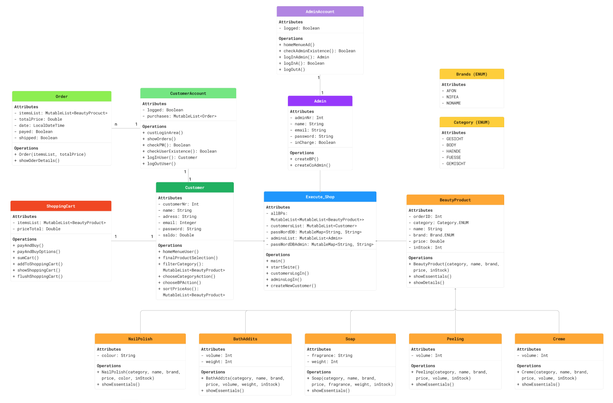

# Kosmetik-Online-Shop

Dieses kleine einfache Programm war die Abschlussarbeit des Moduls 2 - Einführungs in die Programmierung
im Rahmen meiner Fortbildung zum App-Entwickler.

### Es galt einen Online-Shop zu programmieren, der gewisse Mindestvorgaben erfüllen sollte:

- Es sollten mind. 2 Produktsorten verkauft werden
- Es sollte mind. 2 Unterkategorien pro Produktsorte geben
- Es sollte einen Kunden-Bereich und einen Manager-Bereich geben
- Der Kunde kann die Produktauswahl sowohl anhand der Produktart als auch anhand der Kategorie suchen.
- Der Kunde kann die angezeigte Produktauswahl nach Preis aufsteigend sortiert anzeigen lasssen.
- Der Kunde hat einen Warenkorb
- Der Manager kann neue Produkte listen (erstellen und der Verkaufsliste hinzufügen)
- Der Manager kann weitere Manager erstellen

- Das ganze sollte natürlich möglichst objektorientiert programmiert werden. 
Im Optimalfall soll nur eine Methode in der main() stehen, die alles ausführt.

---
Hierzu wurde folgendes Klassendiagramm erstellt:

---

### Unsere Produktsorten:
- BeautyProduct (Mutterklasse)
- Soap
- Creme
- Peeling
- BathAddits
- NailPolish

### Jede dieser Sorten hat folgende Kategorien (ENUM):
- Gesicht
- Body
- Haende
- Fuesse
- Gemischt

### Weiterhin haben die Produkte alle einen Hersteller (ENUM):
- AFON
- NIFEA
- NONAME

---
© Slawomir Z. Dragon

Ich versichere an Eides statt, dass ich dieses Programm völlig selbständig ohne fremde Hilfe geschrieben habe.
Auch Chat-GPT wurde nicht bemüht.
###### Einzige Hilfsmittel: 
- Vorlesungsskripte
- www.w3schools.com
- www.youtube.de
