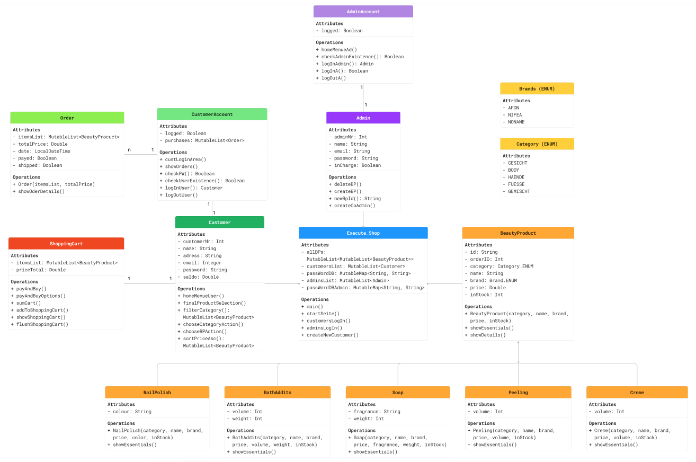

# Kosmetik-Online-Shop

Dieses kleine einfache Programm war die Abschlussarbeit des "Modul 2 - Einführung in die Programmierung mit Kotlin"
im Rahmen meiner Fortbildung zum App-Entwickler beim Syntax Institut GmbH (Berlin).

### Aufgabe: Einen Online-Shop zu programmieren, der gewisse Mindestvorgaben erfüllen sollte:

- Es sollten mind. 2 Produktsorten verkauft werden
- Es sollte mind. 2 Unterkategorien pro Produktsorte geben
- Es sollte einen Kunden-Bereich und einen Manager-Bereich geben
- Der Kunde kann die Produktauswahl sowohl anhand der Produktart als auch anhand der Kategorie suchen.
- Der Kunde kann die angezeigte Produktauswahl nach Preis aufsteigend sortiert anzeigen lasssen.
- Der Kunde hat einen Warenkorb, einen Account und div. Bezahlfunktionen
- Der Manager kann Produkte auslisten (aus dem Sortiment löschen)
- Der Manager kann neue Produkte listen (erstellen und der Verkaufsliste hinzufügen)
- Der Manager kann weitere Manager erstellen
- Das ganze sollte natürlich möglichst objektorientiert programmiert werden. 
Im Optimalfall soll nur eine Methode in der main() stehen, die alles ausführt.

---
Hierzu wurde folgendes Klassendiagramm erstellt:

---

### Unsere Produktsorten:
- BeautyProduct (Mutterklasse)
- Soap
- Creme
- Peeling
- BathAddits
- NailPolish

### Jede dieser Sorten hat folgende Kategorien (ENUM):
- Gesicht
- Body
- Haende
- Fuesse
- Gemischt

### Weiterhin haben die Produkte alle einen Hersteller (ENUM):
- AFON
- NIFEA
- NONAME

Es wurde von mir vor allem Wert auf die Objektorientierung gelegt. 
In der main() wird tatsächlich nur eine Methode aufgerufen (startSeite()), 
welche alle anderen Methoden entsprechend den Eingaben des Users/Admins aufruft.

Bei einer Fehl-Auswahl ruft sich die Methode selbst nochmal auf 
(mit einem Warnhinweis) oder leitet zu einem übergelagerten Menue (Methode).
So fangen sich die Methoden grundsätzlich selbst auf. 

Try/catch wurde aber z.B. verwendet, um Fehleingaben beim Login abzufangen.
Die selbstgebaute Exception wird geschmissen, wenn die Methode
- checkUserExistence() oder
- checkAdminExistence() 
 feststellt, dass die Email vom User/Admin nicht in der DB gespeichert ist.
Auch hier rekursiert die Methode homeMenueUser() bzw. homeMenueAd() solange,
wie eine falsche email eingegeben wird.

Wenn die Email existiert kann der User/Admin das Passwort 3 mal eingeben.
Nach der dritten Fehleingabe wird der Account für eine Stunde gesperrt;
das hat allerdings nichts mit 'Abfangen von Fehlern' zu tun. 

Nach dem standardmäßigen Einlogverfahren wird von der ZENTRALEN Methode
- logInUser()  ein User samt Account und Einkaufskorb 'erstellt' und zurückgegeben
- logInAdmin() ein Admin samt Account 'erstellt' und zurückgegeben

Die zurückgegebenen Objekte können dann jeweils auf ihre Methoden zugreifen, 
wobei sie immer die essenziellen, eben erstellten Parameter weitergeben und 
mit ihnen in einem ewigen Kreislauf arbeiten, gleichsam einem schweizer Uhrwerk.

Es ist ein Festival der Rekursion.

---

### Hinweise
Das Programm ist bei Initialisierung mit einem Grundsortiment ausgestattet.
Die Pseudo-Datenbank befindet sich in utils.kt.
Dort befindet sich auch die Pseudo-DB mit dem Kundenstamm.

All diese Datensätze füllen die Produktlisten (globale Variablen in Execute_Shop.kt)
 sowie die Listen mit Usern/Admins und ihren Passwörtern (aus Sicherheitsgründen getrennt).

Es wird bei jeder Produktbestellung überprüft, ob genügend Artikel im Lager sind.

Der Warenkorb wird erst nach der Bezahlung automatisch geleert, 
er kann aber auch explizit vom User gelöscht werden.

Die Systematik hinter der Namenskonvention der einzelnen Objekte ist wohl offensichtlich:
Erst ein Buchstabe oder mehr (z.B. 'S' für Soap) dann ein Underscore (_) gefolgt von einer laufenden Nummer.

Entsprechend dieser Logik wird von der Funktion Admin.newBpId() eine neue ID generiert,
welche auch immer eine Zahl höher liegt, als die letzte (höchste). 
Das brauchen wir für die Erstellung neuer Produkte durch den Admin/Manager. 

---
© Slawomir Z. Dragon

Ich versichere an Eides statt, dass ich dieses Programm völlig selbständig ohne fremde Hilfe geschrieben habe.
Auch Chat-GPT wurde nicht bemüht.
###### Zentrale Hilfsmittel: 
- Vorlesungsskripte samt Beispielcodes
- www.kotlinlang.org
- www.developer.android.com/kotlin
- www.w3schools.com
- www.youtube.de
